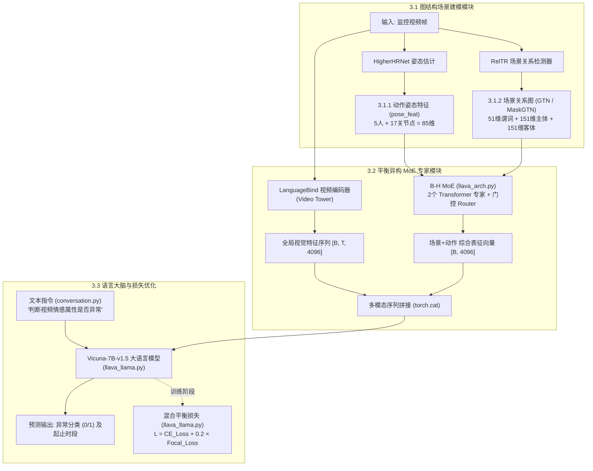

# Hawkeye 论文第三节（方法部分）与源码深度映射解读

> **论文题目**：*Hawkeye: Discovering and Grounding Implicit Anomalous Sentiment in Recon-videos via Scene-enhanced Video Large Language Model* (ACM MM 2024)  
> **源码仓库**：[Hawkeye-main](file:///d:/learning_box/research/code/work/Hawkeye-main)

---

## 一、系统全景架构概览

在侦察与监控视频（Recon-videos）中，声音、清晰的面部表情往往缺失，普通的通用视频大模型（如 Video-LLaVA、Video-ChatGPT）仅关注粗粒度整帧视觉特征，难以捕捉“隐式异常情绪”（如打架、偷窃、非法入侵、虐待等）。

论文的核心动机：**引入细粒度人体骨骼动作（Action）与物体拓扑交互（Scene Graph），并通过异构 MoE 平衡机制送入大语言模型进行决策。**



---

## 3.0 任务形式化与骨干网络 (Problem Formulation & Backbone)

### 1. 任务定义 (IasDig Task)
- **输入**：侦察视频 $V = \{f_1, f_2, ..., f_T\}$，共 $T$ 帧。
- **任务目标**：交互式发现并定位（Classify and Ground）隐式异常情绪。
  - 分类：预测视频是否异常（0 正常，1 异常）；
  - 定位：输出包含隐式异常情绪的时间区间集合 $\{(s_1, e_1), ..., (s_n, e_n)\}$。

### 2. 骨干模型与配置
- **Backbone**：采用 **Video-LLaVA** 作为架构底座。
- **视觉塔**：**LanguageBind**（将视频特征预先对齐至统一的多模态特征空间）。
- **语言大脑**：**Vicuna-7B-v1.5**（70 亿参数大模型）。
- **代码配置文件**：
  - [checkpoints/Video-LLaVA-Pretrain-7B/config.json](file:///d:/learning_box/research/code/work/Hawkeye-main/checkpoints/Video-LLaVA-Pretrain-7B/config.json)
  - [llava/model/builder.py: Line 50-84](file:///d:/learning_box/research/code/work/Hawkeye-main/llava/model/builder.py#L50-L84)：`load_pretrained_model` 负责动态挂载基础 Vicuna 底座、非 LoRA 投影器及 LoRA 适配层。

---

## 3.1 图结构场景建模模块 (Graph-structured Scene Modeling Module)

论文提出，细粒度场景信息包含两个维度：
1. **个体动作 (Action)**
2. **物体交互拓扑关系 (Object-Relation)**

---

### 3.1.1 动作敏感图 (Action-Sensitive Graph, ASG)

#### 【论文原理】
- **Q1: 如何捕获个体的动作信息？**
  采用人体姿态估计网络 **HigherHRNet** 检测每一帧中人体的 **17 个关键骨骼点**，构建骨骼姿态序列 $X_a = \{x_a^1, ..., x_a^n\}$。
- **Q2: 如何将动作特征融合至大模型？**
  论文通过动作图注意力层将姿态关键点投射为具有语义特征的向量序列。

#### 【代码落地】
- **源码文件**：[llava/model/llava_arch.py: Line 63-80](file:///d:/learning_box/research/code/work/Hawkeye-main/llava/model/llava_arch.py#L63-L80)
- **核心类实现**：
  ```python
  class pose_feat(nn.Module):
      def __init__(self):
          super(pose_feat, self).__init__()
          # 85 = 5 个人物目标 × 17 个骨骼坐标点
          # 通过线性层将姿态数据投射为与 LLM 匹配的 4096 维隐藏空间
          self.pose_projector = nn.Linear(85, 4096)
          self.pose_projector.requires_grad_(True)

      def forward(self, pose_feat):
          pose_feat = pose_feat.view(pose_feat.size(0), -1)
          pose_feat = self.pose_projector(pose_feat)
          return pose_feat  # 输出: [Batch, 4096]
  ```
- **构建入口**：
  - `build_pose_tower()`：实例化 `pose_feat` 模型。
  - `encode_poses()` (Line 682)：前向传播中对人体姿态进行对齐投影。

---

### 3.1.2 物体关系敏感图 (Object-Relation Sensitive Graph, ORG / MaskGTN)

#### 【论文原理】
- **Q1: 如何提取物体与环境的相互作用？**
  使用关系检测网络 **RelTR**（Relation Transformer）检测视频帧中出现的实体和交互谓词，构建物体关系图 $G_i = (R_i, E_i)$。
  - 节点集合 $R_i$：检测到的 $k$ 个物体类别 $c$ 及其边界框坐标 $b$；
  - 边集合 $E_i$：有向关系边 $\{c_{i,p}, r_{i,(p,q)}, c_{i,q}\}$（如 `(man, near, door)`）。
- **Q2: 如何使用图神经网络进行拓扑语义聚合？**
  论文提出了 **MaskGTN（图 Transformer 网络）**，对应论文公式 (4)：
  $$H^{(\ell+1)} = \sigma \left( \tilde{D}^{-\frac{1}{2}} \tilde{A} \tilde{D}^{-\frac{1}{2}} H^{(\ell)} W^{(\ell)} \right)$$
  其中 $\tilde{A}$ 为带权交互邻接矩阵，$\tilde{D}$ 为度矩阵，$W^{(\ell)}$ 为可学习权重，最后经 FFN 获得场景 Token $X_s$。

#### 【代码落地】
- **源码文件**：[llava/model/llava_arch.py: Line 40-177](file:///d:/learning_box/research/code/work/Hawkeye-main/llava/model/llava_arch.py#L40-L177)
- **151 类实体词汇表** (Line 40-58)：
  ```python
  CLASSES = [
      'N/A', 'airplane', 'animal', 'arm', 'bag', 'banana', 'basket', 'beach', 
      'bear', 'bed', 'bench', 'bike', 'bird', 'board', 'boat', 'book', 'boot',
      ..., 'window', 'woman', 'zebra'
  ]  # 共 151 个实体类别
  ```
- **基于 PyG 的图卷积层 `GTNLayer`** (Line 83-118)：
  ```python
  class GTNLayer(MessagePassing):
      def __init__(self, in_channels, out_channels, edge_attr_dim):
          super(GTNLayer, self).__init__(aggr='add')
          self.linear = nn.Linear(in_channels, out_channels)
          self.edge_attr_linear = nn.Linear(edge_attr_dim, in_channels)
          self.edge_attr_dim = edge_attr_dim

      def forward(self, x, edge_index, edge_attr=None):
          # 添加自环并结合有向边属性
          edge_index, edge_attr = self.add_self_loops_with_edge_attr(edge_index, edge_attr, x.size(0), self.edge_attr_dim)
          x = self.propagate(edge_index, x=x, edge_attr=edge_attr)
          return self.linear(x)

      def message(self, x_j, edge_index, edge_attr):
          # 节点特征与边属性融合
          if edge_attr is not None:
              edge_attr_transformed = self.edge_attr_linear(edge_attr.to(dtype=x_j.dtype))
              return x_j + edge_attr_transformed
          return x_j
  ```
- **拓扑构图与池化主体 `GTN`** (Line 120-170)：
  ```python
  class GTN(nn.Module):
      def forward(self, scene_feat):
          # 拆分 RelTR 抽取的 353 维特征向量:
          # 前 51 维 = 交互谓词概率 (edge_attr)
          # 中间 151 维 = 主体类别的预测概率 (node_feat sub)
          # 后面 151 维 = 客体类别的预测概率 (node_feat obj)
          probas, probas_sub, probas_obj = scene_feat[:, :51], scene_feat[:, 51:202], scene_feat[:, 202:]
          
          # 动态构建节点与边
          nodes, edges, node_features = [], [], []
          for i in range(probas.shape[0]):
              sub = CLASSES[probas_sub[i].argmax()]
              obj = CLASSES[probas_obj[i].argmax()]
              if sub not in nodes:
                  nodes.append(sub)
                  node_features.append(probas_sub[i])
              if obj not in nodes:
                  nodes.append(obj)
                  node_features.append(probas_obj[i])
              edges.append((sub, obj))
          
          # 封装为 PyTorch Geometric 图数据
          graph = Data(x=torch.stack(node_features, dim=0), edge_index=edge_index, edge_attr=probas)
          
          # 迭代图卷积更新
          x, edge_index, edge_attr = graph.x, graph.edge_index, graph.edge_attr
          for layer in self.conv_layers:
              x = layer(x, edge_index, edge_attr)
          
          # 全局均值池化 + 线性变换至 4096 维
          x = gnn.global_mean_pool(x, torch.arange(0, x.size(0), dtype=torch.long, device=x.device))
          return self.linear(x)
  ```

---

## 3.2 平衡异构混合专家网络 (Balanced Heterogeneous MoE Module, B-H MoE)

### 【论文原理】
- **设计动机**：
  动作骨骼特征与物体拓扑图特征属于结构迥异的异质信息。在联合训练中容易出现特征主导偏向。
- **论文公式 (5)**：
  通过两个投射专家（Projection Experts, PE）和软门控路由器 $R$ 进行动态重加权：
  $$y = \text{LayerNorm} \left( \sum_{i=1}^N R(h)_i E_i(h) \right)$$
  其中路由器通过 $R(\cdot) = \text{Softmax}(h W_g)$ 依据当前帧的场景复杂度自适应分配每个专家网络的比重。

### 【代码落地】
- **源码文件**：[llava/model/llava_arch.py: Line 420-485](file:///d:/learning_box/research/code/work/Hawkeye-main/llava/model/llava_arch.py#L420-L485)
- **核心类实现**：
  ```python
  class MOE(nn.Module):
      def __init__(self, params):
          super(MOE, self).__init__()
          self.num_experts = 2          # 对应论文中的 N=2 个专家
          self.num_resample_layers = 1
          
          # 搭建专家网络 (每个专家包含一层 TransformerBlock 重采样器)
          self.resample_layers = nn.ModuleDict()
          for expert in range(self.num_experts):
              self.resample_layers[str(expert)] = nn.ModuleList([TransformerBlock(...)])
              
          # 对应论文中的 Modality Router R (由多层感知机实现)
          self.routers['pose'] = Mlp(4096, 4096 * 4, self.num_experts)

      def forward(self, pose_feat, scene_feat):
          # 1. 拼接动作特征与场景图特征
          image_feats = torch.cat((pose_feat, scene_feat), dim=1)
          
          # 2. 对应论文公式 (5) 计算专家门控分配权重 R(h)
          routing_weights = self.routers['pose'](image_feats).sigmoid()
          routing_weights = routing_weights / routing_weights.sum(dim=-1, keepdim=True)
          
          # 3. 分配至各个专家 E_i(h) 并加权组合
          image_feats_experts = []
          for expert_id in range(self.num_experts):
              image_feats_expert = self.resample_layers[str(expert_id)](image_feats)
              routing_weight = routing_weights[:, :, expert_id:expert_id+1]
              image_feats_experts.append(image_feats_expert * routing_weight)
          
          # 4. 求和并经由 LayerNorm/Projection 输出
          image_feats = sum(image_feats_experts)
          image_feats = self.clip_proj2['pose'](image_feats)
          return image_feats.reshape(-1, 4096)
  ```

- **最终多模态拼接进入大语言模型** (Line 734-736)：
  ```python
  # 1. 调用 MoE 模块获得动态融合特征
  X_moe_feat = getattr(self, 'moe_route')(X_features_pose, X_features_scene)

  # 2. 与 LanguageBind 的原始视频序列特征拼接
  X_features.append(torch.cat((X_features_video[i], X_moe_feat), dim=0))
  ```

---

## 3.3 模型优化与损失函数 (Model Optimization for Hawkeye)

### 3.3.1 两阶段微调流水线 (Two-Stage Tuning)
1. **Stage 1 (预微调)**：
   使用 RefCOCO（目标区域描述）与 HumanML3D（人体动作描述）对多模态交互层进行初步对齐，赋予模型识别场景基本实体与人物行为的能力。
2. **Stage 2 (IasDig 专属微调)**：
   在 TSL-300 与 UCF-Crime 异常视频数据集上微调，Prompt 指令为：
   *“Analyze the following video and locate the timestamps when the individuals in the video convey implicit anomalous sentiments.”*
   - 执行脚本：[scripts/v1_5/finetune_lora_a100.sh](file:///d:/learning_box/research/code/work/Hawkeye-main/scripts/v1_5/finetune_lora_a100.sh)
   - 采用 DeepSpeed Zero-2、学习率 `2e-5`、LoRA 秩 `r=64`。

---

### 3.3.2 类别极端不平衡与 Focal Loss 优化

#### 【论文原理】
真实监控场景中 95% 以上的时间没有任何异常事件发生。使用常规 Cross-Entropy 损失会导致大模型陷入严重的数据偏置（倾向于全部预测为“正常”，引发极高的假阴性 FNR）。
论文引入 Focal Loss 对容易判断的正常样本降低梯度惩罚权重，聚焦于难分类的隐式异常事件：
$$\mathcal{L}_{total} = \mathcal{L}_{CE} + \lambda \mathcal{L}_{Focal}$$

#### 【代码落地】
- **源码文件**：[llava/model/language_model/llava_llama.py: Line 30-57, Line 128-135](file:///d:/learning_box/research/code/work/Hawkeye-main/llava/model/language_model/llava_llama.py#L30-L57)
```python
# 1. Focal Loss 模块定义
class FocalLoss(nn.Module):
    def __init__(self, alpha=0.25, gamma=2, reduction='mean'):
        super(FocalLoss, self).__init__()
        self.alpha = alpha     # 平衡因子
        self.gamma = gamma     # 焦点因子 (降低易分样本权重)
        self.reduction = reduction

    def forward(self, ce_loss):
        p_t = torch.exp(-ce_loss)
        pos_weights = (1 - p_t) ** self.gamma
        neg_weights = p_t ** self.gamma
        pos_loss = self.alpha * pos_weights * ce_loss
        neg_loss = (1 - self.alpha) * neg_weights * ce_loss
        loss = pos_loss + neg_loss
        return loss.mean() if self.reduction == 'mean' else loss

# 2. 训练前向传播中的损失整合 (LlavaLlamaForCausalLM.forward)
loss_fct = CrossEntropyLoss()
fc_loss = FocalLoss(alpha=0.25, gamma=2, reduction='mean')
ce_loss = loss_fct(shift_logits, shift_labels)

# 对应论文中的最终总损失 (lambda 取 0.2)
loss = ce_loss + 0.2 * fc_loss(ce_loss)
```

---

## 四、论文数学符号与代码对应速查表

| 论文符号 | 含义 | 对应代码变量 / 类名 | 所在文件与行号 |
| :--- | :--- | :--- | :--- |
| $V$ | 待检测监控视频 | `--video` / `video_path` | [infer_video.py](file:///d:/learning_box/research/code/work/Hawkeye-main/infer_video.py#L17) |
| $X_v$ | 原始视觉视频 Token | `X_features_video` | [llava_arch.py: Line 720](file:///d:/learning_box/research/code/work/Hawkeye-main/llava/model/llava_arch.py#L720) |
| $X_a$ / ASG | 人体动作骨骼拓扑 | `poses` / `class pose_feat` | [llava_arch.py: Line 63](file:///d:/learning_box/research/code/work/Hawkeye-main/llava/model/llava_arch.py#L63) |
| $G_i$ / ORG | 物体拓扑场景图 | `scenes` / `class GTN` | [llava_arch.py: Line 120](file:///d:/learning_box/research/code/work/Hawkeye-main/llava/model/llava_arch.py#L120) |
| $H^{(\ell)}$ | GTN 图卷积隐层状态 | `x = layer(x, edge_index)` | [llava_arch.py: Line 163](file:///d:/learning_box/research/code/work/Hawkeye-main/llava/model/llava_arch.py#L163) |
| $R(\cdot)$ | MoE 动态门控路由器 | `self.routers['pose']` | [llava_arch.py: Line 444](file:///d:/learning_box/research/code/work/Hawkeye-main/llava/model/llava_arch.py#L444) |
| $E_i(\cdot)$ | MoE 投射专家 | `self.resample_layers` | [llava_arch.py: Line 428](file:///d:/learning_box/research/code/work/Hawkeye-main/llava/model/llava_arch.py#L428) |
| $y$ (公式 5) | MoE 场景与姿态融合特征 | `X_moe_feat` | [llava_arch.py: Line 734](file:///d:/learning_box/research/code/work/Hawkeye-main/llava/model/llava_arch.py#L734) |
| $\mathcal{L}_{total}$ | 混合平衡损失函数 | `ce_loss + 0.2 * fc_loss` | [llava_llama.py: Line 135](file:///d:/learning_box/research/code/work/Hawkeye-main/llava/model/language_model/llava_llama.py#L135) |

---

## 五、结论与阅读建议

1. **若探究模型结构创新**：重点研读 [llava/model/llava_arch.py](file:///d:/learning_box/research/code/work/Hawkeye-main/llava/model/llava_arch.py)（GTN 构图与池化、HigherHRNet 线性映射、MOE 门控路由）。
2. **若探究正负样本失衡解决方案**：重点研读 [llava/model/language_model/llava_llama.py](file:///d:/learning_box/research/code/work/Hawkeye-main/llava/model/language_model/llava_llama.py) 中的 `FocalLoss` 实现。
3. **若探究实际视频推理落地**：重点研读我们构建的 [infer_video.py](file:///d:/learning_box/research/code/work/Hawkeye-main/infer_video.py)，其中实现了当离线特征缺失时的零向量自适应补齐与时间戳滑窗推理机制。
